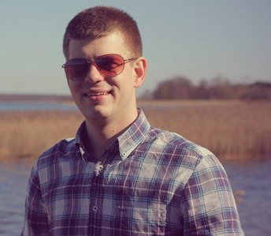

# Yaroslav Mescheryakov

---

## Personal information:

Date of birth: 19 August 1987  
Gender: male  
Birth Place: Germany, Magdeburg  
Registration address: 50 Let Pobedy Street, 3-61, Minsk, 220056, Belarus

## Education:

Stydy period: _2005 \- 2010_  
Place: _Belarussian State Economic University_  
Faculty: _Department of managment_

## Summary:

I started to learn programming in 2018. I have become more interested in learning of JS, CSS and HTML. I had set myself a new goal that I want to become a front-end developer.  
When I have a free time, I try to spend it on my studies. My educational process include watching
video, reading book and certainly doing exercise. Essential element is practise. I consider, programmer often face on new chalenge for work. He have to solve new task. Thus, you should always train your brain and improve your skills.  
So, I like it. It\`s chalenge for me.

## Experience:

I havn\`t any commercial experience in developing web site or program. I executed some elements of markup, create landing-page and solved different JS tasks on courses.

## Courses:

- IT-Academy: [_courses for web-developer_](https://www.it-academy.by/course/front-end-developer/)
- Codecademy: [_achievements_](https://www.codecademy.com/users/flogger23/achievements/)
- Htmlacademy: [_achievements_](https://htmlacademy.ru/profile/id1047383/achievements)
- Codewars: [_rank_](https://www.codewars.com/users/flogger23/)
- Udemy: [_video courses_](https://www.udemy.com/home/my-courses/learning/)

## Skills:

- Languages: `HTML5`, `CSS3`, `JavaScript`
- Version control system: `Git`
- Graphics editor: `Photoshop`

## Foreign languages:

- English: **A2**  
  _Experience: preparation report for management, business correspondence, participation in meeting_
